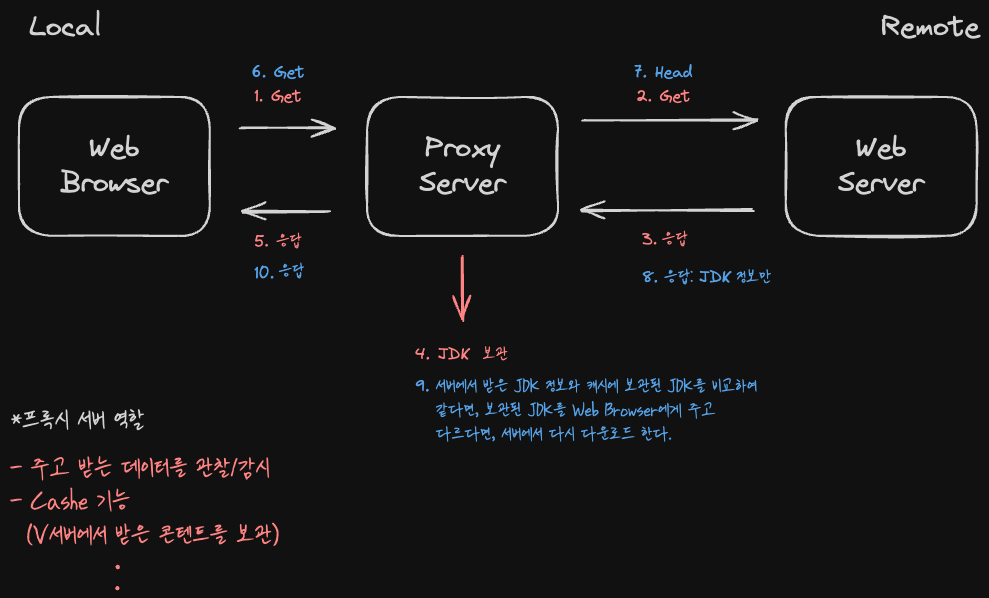
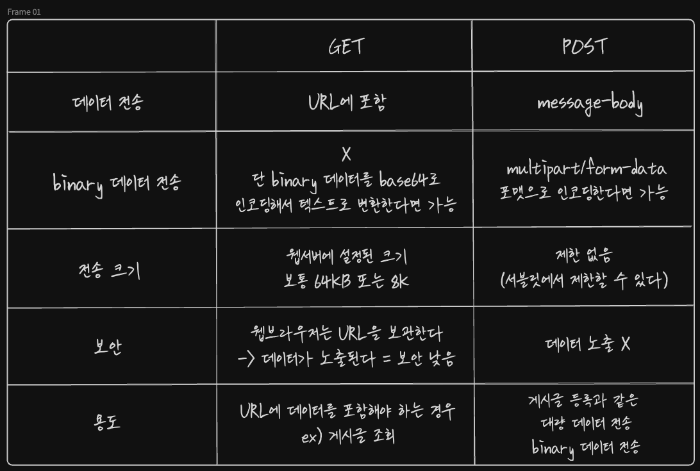

# 서블릿에서 출력하기
## 텍스트 출력
ServletResponse에 대해 getWriter()를 호출하면 PrintWriter를 리턴한다.
```java
PrintWriter out = servletResponse.getWriter();
```

PrintWriter에 대해 print를 출력하면 버퍼에 쌓아 한번에 출력한다. HTTP 프로토콜은 1요청에 반드시 1응답만 존재하기 때문에 이러한 방식만 가능하다.

PrintWriter의 기본 스트림은 기본 문자표 ISO-8859-1을 사용한다. 따라서 응답시 자바의 유니코드 문자를 ISO-8859-1 문자표에 따라 변환하여 출력한다. 

영어 유니코드 문자는 제대로 변환되지만 한글과 같이 코드표에 존재하지 않는 문자는 변환이 불가하여 '?'로 바뀌어 출력된다. 

**한글 깨짐 처리하기**
출력 스트림을 꺼내기 전에 출력 스트림이 사용할 문자표(charset)을 지정하면 된다. 
```java
// res.setContentType("MIME Type;charset=문자표이름");

res.setContentType("text/plain;charset=UTF-8"); 
    PrintWriter out = res.getWriter();
```

*MIME Type : Multi-purpose Internet Mail Extension
- 콘텐츠의 Format을 가리키는 타입
- ex) text/plain, text/css, text/html

## HTML 출력
HTML 출력할 때 MIME 타입에 HTML을 지정하지 않으면 웹 브라우저는 일반텍스트로 간주한다. 
```java
res.setContentType("text/html;charset=UTF-8");
PrintWriter out = res.getWriter();
```

## 바이너리 데이터 출력
1. 서블릿의 환경 정보를 다루는 객체를 먼저 얻는다.
```java
ServletContext ctx = req.getServletContext();
```

2. ServletContext를 통해 웹 자원의 실제 경로를 알아낸다 = getRealPath()로 실제 전체 경로를 리턴한다.
```java
String path = ctx.getRealPath("/kk.jpeg");
FileInputStream in = new FileInputStream(path);
```

3. 파일에 해당하는 MIME 타입을 지정한다. 모르는 형식을 지정하면 웹브라우저는 그냥 다운로드 대화상자를 렌더링한다.
```java
res.setContentType("image/jpeg");
```

4. 바이너리 데이터를 버퍼에 쌓아 한번에 출력한다.
```java
OutputStream out = res.getOutputStream();

int b;
  while ((b = in.read()) != -1) {
    out.write(b);
  }

  out.flush(); // 버퍼 데코레이터에 보관된 데이터를 클라이언트로 방출한다.
```

# HTTP 
> Web browser와 Web server 사이에 데이터를 주고 받는 규칙

**1. 요청 규칙**  
Request-Line <- `Method SP Request-URI SP HTTP-Version CRLF`  
- Method: GET, POST, HEAD, PUT, DELETE, OPTIONS, TRACE
- Request-URI: 식별자, 요청 대상, 배치 경로
- SP: Space(공백)

general-header* <- 요청, 응답에 모두 사용; Date, Connection..  
request-header* <- 요청에서 사용; Accept, Host, User-Agent..  
entity-header* <- 서버에 보내는 데이터 정보; Content-Type, Content-Length..  
CRLF <- 줄바꿈  
message-body <- 서버에 보내는 데이터


```
요청 예
GET /java-web/ex04/s1?name=AB%EA%B0%80%EA%B0%81&age=20 HTTP/1.1
Host: localhost:8080
Connection: keep-alive
Pragma: no-cache
Cache-Control: no-cache
Upgrade-Insecure-Requests: 1
User-Agent: Mozilla/5.0 (Macintosh; Intel Mac OS X 10_13_6) AppleWebKit/537.36 (KHTML, likeGecko) Chrome/73.0.3683.86 Safari/537.36
Accept: text/html,application/xhtml+xml,application/xml;q=0.9,image/webp,image/apng,
Accept-Encoding: gzip, deflate, br
Accept-Language: ko-KR,ko;q=0.9,en-US;q=0.8,en;q=0.7,la;q=0.6
빈 줄
```
<br>

**2. 응답 규칙**  
Status-Line <- `HTTP-Version SP Status-code SP Reason-Phrase CRLF`
- Status-code: 100~ 응답 결과 코드
- Reason-Phrase: 응답 코드 내용

general-header* 
response-header* <- 응답할 때 사용; server, location
entity-header*
CRLF
message-body

```
응답 예
HTTP/1.1 200 OK
Content-Type: text/plain;charset=UTF-8
Content-Length: 27
Date: Thu, 28 Mar 2019 05:46:08 GMT
    <== 빈 줄
이름=홍길동
나이=20
```

#### *Proxy Server


# GET 요청
## GET 요청 방법
**1. URL 입력**
웹 브라우저에 URL을 입력한 후 엔터를 치면 GET 요청을 보낸다.

**2. 링크 클릭**
웹 페이지에서 링크를 클릭하면(자바스크립트 처리하지 않은 상태) GET 요청을 보낸다.

**3. 입력폼 전송**
웹 페이지의 폼(method='GET' 일 때)에서 전송 버튼을 클릭하면 GET 요청을 보낸다.

## GET 요청으로 데이터 전송
- GET 요청은 데이터를 request-URI에 붙여서 보낸다. 
```
ex)
http://서버/포트/ex04/s1?name=aaa&age=20
```
- 데이터 형식은 "이름=값&이름=값.."으로 보내며 WebServer로 보내는 과정에서 URL 인코딩/디코딩이 이루어진다.
- getParameter로 값을 꺼내면 UTF-8 코드를 자바 String에서 사용할 UTF-16BE 코드로 변환한다. (단 톰캣 7 이하 버전에서는 클라이언트가 보낸 데이터가 UTF-8이라고 설정해주어야 한다.)

## 웹 브라우저가 GET 요청으로 보낸 데이터 읽기
ServletRequest의 getParameter('파라미터이름')을 통해 데이터를 읽는다.


# POST 요청
## POST 요청 방법
웹 페이지의 폼(method='POST' 일 때)에서 전송 버튼을 클릭하면 POST 요청을 보낸다.

## POST 요청으로 데이터 전송
- POST 요청은 message-body에 데이터를 실어 보낸다. 
```
ex)
POST /ex04/s2 HTTP/1.1
...
Content-Type : application/x-www-form-urencoded 
Content-Length: 32                              
...
name=AB%EA%B0%80%EA%B0%81&age=20 <- message-body = entity
```

## 웹 브라우저가 POST 요청으로 보낸 데이터 읽기
데이터를 읽을 때는 GET 요청과 마찬가지로 ServletRequst의 getParameter("파라미터이름") 메서드를 통해 읽는다.  

다만 POST 요청으로 보낸 데이터는 서블릿 컨테이너 측에서 기본값이 ISO-8859-1로 설정되어 있어 영어가 아닌 언어를 읽으면 깨진 문자를 리턴한다. 

따라서 getParameter를 최초로 호출하기 전에 클라이언트가 보낸 데이터의 인코딩 형식이 어떤 charset인지 ServletRequest의 setCharacterEncoding()으로 지정해주어야 한다. 

# GET VS POST


**1. 데이터 전송 방식**
- GET
  - request uri(URL 주소)에 데이터를 포함한다.
    예) /java-web/ex04/s1?name=AB%EA%B0%80%EA%B0%81&age=20
- POST
  - message body에 데이터를 포함한다.
    예) name=AB%EA%B0%80%EA%B0%81&age=20

**2. 전송 데이터 용량**
- GET
  - 대부분의 웹서버가 request-line과 헤더의 크기를 8KB로 제한하고 있다.
  - 따라서 긴 게시글과 같은 큰 용량의 데이터를 GET 방식으로 전송할 수 없다.
- POST
  - HTTP 요청 헤더 다음에 message-body 부분에 데이터를 두기 때문에 용량의 제한 없이 웹 서버에 전송할 수 있다.
  - 즉 웹 서버가 제한하지 않는 한 전송 데이터의 크기에 제한이 없다.
  - 웹 서버가 제한한다?
    특정 사이트에서는 게시글의 크기나 첨부파일의 크기에 제한을 둔다.

**3. 용도**
- 게시글 조회나 검색어 입력 같은 간단한 데이터 전송에는 GET 요청으로 보내고
- 게시글 등록이나 첨부파일 같은 큰 데이터 전송에는 POST 요청으로 보낸다.

**4. 바이너리 데이터 전송**
- GET
  - request-URI가 텍스트로 되어 있다. 따라서 바이너리 데이터를 request-URI에 붙여서 전송할 수 없다.
  - 그럼에도 꼭 GET 요청으로 바이너리 데이터를 보내고자 한다면 바이너리 데이터를 텍스트로 변환하면 된다. 예를 들어 바이너리 데이터를 Base64로 인코딩하여 텍스트를 만든 후에 GET 요청 방식대로 이름=값 으로 보내면 된다.
  - 그래도 결국 용량 제한 때문에 바이너리 데이터를 GET 요청으로 전송하는 것은 바람직하지 않다.
- POST
  - 이 방식에서도 이름=값 형태로는 바이너리 값을 전송할 수 없다.
  - multipart 형식을 사용하면 바이너리 데이터를 보낼 수 있다.
  - 보통 파일 업로드를 구현할 때 이 multipart 전송 방식으로 사용한다.

**5. 보안**
- GET
  - URL에 전송 데이터가 포함되어 있기 때문에 사용자 아이디나 암호 같은 데이터를 GET 방식으로 전송하는 것은 위험하다.
  - 웹 브라우저는 주소 창에 입력한 값을 내부 캐시에 보관해 두기 때문이다.
  - 그러나 게시물 번호 같은 데이터는 URL에 포함되어야 한다. 그래야 다른 사람에게 URL과 함께 데이터를 보낼 수 있다.
- POST
  - mesage-body 부분에 데이터가 있기 때문에 웹 브라우저는 캐시에 보관하지 않는다.또한 주소 창에도 보이지 않는다.
  - 사용자 암호 같은 데이터를 전송할 때는 특히 이 방식으로 보내는 것이 바람직 하다.
  - 즉 보내는 데이터를 웹 브라우저의 캐시 메모리에 남기고 싶지 않을 때는 POST 방식을 사용한다.
  - 거꾸로 특정 페이지를 조회하는 URL일 경우 POST 방식을 사용하면 URL에 조회하려는 정보의 번호나 키를 포함할 수 없기 때문에 이런 상황에서는 POST 방식이 적절하지 않다. 오히려 GET 방식이 적합하다.

# 파일 업로드 처리
GET 요청이나 일반 POST 요청을 한 경우에는 파일이 이름만 넘어오고 파일 데이터는 넘어오지 않는다. 따라서 기존의 getParameter() 메서드로는 멀티파트 형식으로 전송된 데이터를 읽을 수 없다.

**멀티파트 POST 요청 예**
멀티파트 요청에서는 "boundary=----WebKitFormBoundaryT1G23U6fYMK0zZxx" 라는 경계 식별자를 통해 데이터 조각을 구분한다. 어떤 부분이 어떤 종류의 데이터인지 파악할 수 있도록 하는 역할이며 마지막 경계 식별자는 "--"가 붙는다.
```
POST /eomcs-java-web/ex04/s3 HTTP/1.1
Host: 192.168.1.10:9999
Content-Length: 248900
Pragma: no-cache
Cache-Control: no-cache
Origin: http://192.168.1.10:9999
Upgrade-Insecure-Requests: 1
Content-Type: multipart/form-data; boundary=----WebKitFormBoundaryT1G23U6fYMK0zZxx
User-Agent: Mozilla/5.0 (Macintosh; Intel Mac OS X 10_13_6) AppleWebKit/537.36 (KHTML, like
Gecko) Chrome/80.0.3987.149 Safari/537.36
Accept:
text/html,application/xhtml+xml,application/xml;q=0.9,image/webp,image/apng,*/*;q=0.8,application/signed-exchange;v=b3;q=0.9
Referer: http://192.168.1.10:9999/eomcs-java-web/ex04/test03.html
Accept-Encoding: gzip, deflate
Accept-Language: ko-KR,ko;q=0.9,en-US;q=0.8,en;q=0.7,la;q=0.6,cs;q=0.5
Connection: keep-alive

------WebKitFormBoundaryT1G23U6fYMK0zZxx
Content-Disposition: form-data; name="name"

AB가각
------WebKitFormBoundaryT1G23U6fYMK0zZxx
Content-Disposition: form-data; name="age"

20
------WebKitFormBoundaryT1G23U6fYMK0zZxx
Content-Disposition: form-data; name="photo"; filename="actors.jpg"
Content-Type: image/jpeg

바이너리데이터...
------WebKitFormBoundaryT1G23U6fYMK0zZxx--
```

## 방법
Base64로 인코딩하여 GET 요청으로 파일을 보낼 수 있지만 용량의 크기 제한이 있어 적합하지 않다.

POST 요청으로 데이터를 읽는 방법은 3가지가 있다.
1. 개발자가 직접 멀티파트 형식을 분석하여 데이터를 추출한다.(X)
2. 외부 라이브러리를 사용한다.
3. Servlet 3.0 부터 제공하는 기능을 이용한다.

## 

개발자가 직접 멀티파트 형식을 분석하는 1번의 방법은 비효율적이라 추천하지 않는다.

일반적으로 apache.org에서 제공하는 외부라이브러리인 multipart/form-data 형식이나 Servlet 3.0 이상 버전의 기본 라이브러리를 사용한다. 

현재 실무에서는 Servlet 3.0 기본 라이브러리를 많이 사용하지만 아직도 multipart/form-data 형식을 사용하는 곳도 있기 때문에 둘 다 알고 있는 것이 좋다. 

