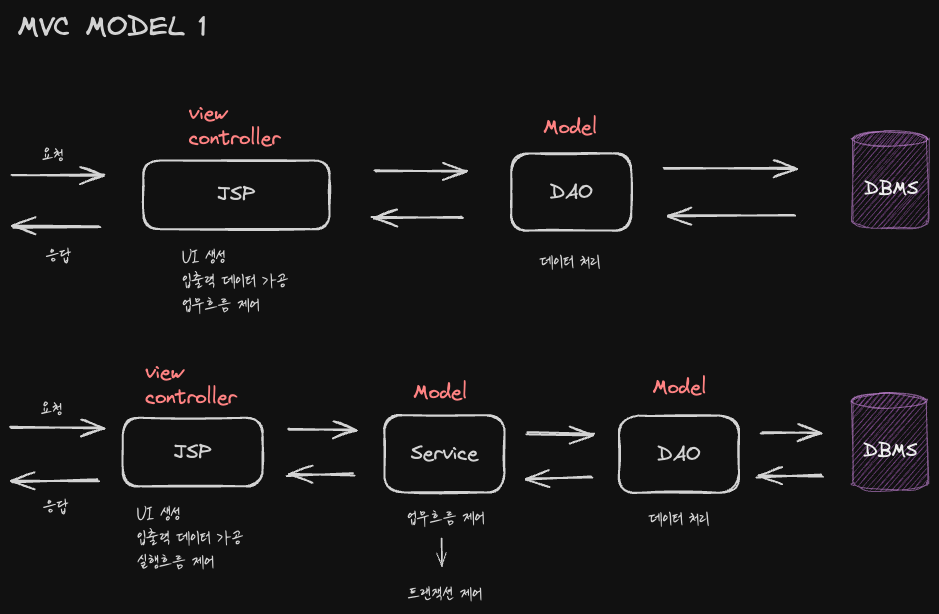

# JSP(Java Server Page) 도입
JSP는 HTML 코드에 Java 코드를 넣어 동적 웹페이지를 생성해주는 웹 애플리케이션 도구이다.

JSP를 도입하면 정적 웹페이지인 HTML 내부에 자바 소스코드를 넣음으로써 서블릿에 HTML코드를 작성하는 것보다 간편하게 작성할 수 있고 가독성 또한 올라간다.

JSP 소스파일은 JSP Engine에 의해 컴파일 되어 자바 서블릿 소스파일로 변환되고 이후 자바 컴파일러가 클래스 파일로 변환한다. 

결국 JSP를 도입하면 서블릿은 입력데이터를 가공, 요청 작업 처리 후 클라인언트로 보낼 화면을 만드는 JSP를 실행(forward)하는 역할을 맡게 되고 JSP는 서블릿이 준비한 데이터를 가지고 HTML,CSS,JavaScript 등의 화면을 만든다.

## JSP와 MVC 모델 1

## JSP MVC 모델 2

모든 요청은 서블릿이 받는다. 

